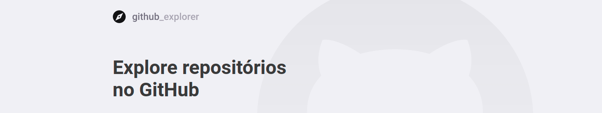
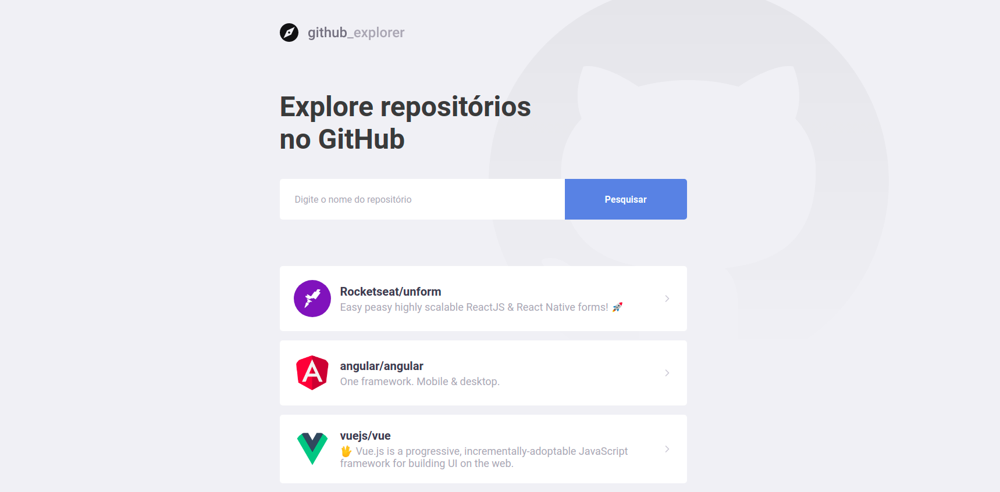
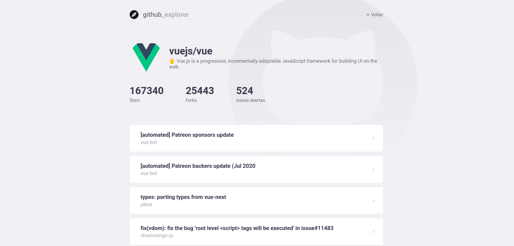

<div align="center" style="margin-bottom: 20px;">

</div>

<div align="center" style="margin: 20px;">

[](http://github.com/jefferson1104/github-explorer-reactJS/LICENSE.md)


<p align="center" >
  <a href="#rocket-tecnologias-usadas"> :rocket: Tecnologias Usadas</a> |
  <a href="#fire-prévia-da-aplicação"> :fire: Prévia da Aplicação</a> |
  <a href="#thinking-como-contribuir?"> :thinking: Como Contribuir?</a> |
  <a href="#zap-executando-o-projeto"> :zap: Executando o Projeto </a>
</p>

</div>

## O projeto

Aplicação feita em reactJS, consumindo api publica do GitHub para buscar repositórios, salvar as buscas em localStorage no browser e mostrar detalhes do repositório encontrado na pesquisa como por exemplo as Issues, quantos Forks o repositório teve etc...

### :rocket: Tecnologias Usadas

O projeto foi feito com as seguintes tecnologias:

- [ReactJS](https://pt-br.reactjs.org/)
- [Styled-Components](https://styled-components.com/)


## :thinking: Como Contribuir?
**Faça um fork deste repositório**

```bash
# Clone o seu fork
$ git clone url-do-seu-fork && cd github-explorer-reactJS

# Crie uma branch com sua feature ou correção de bugs
$ git checkout -b minha-branch

# Faça o commit das suas alterações
$ git commit -m 'feature/bugfix: minhas alterações'

# Faça o push para a sua branch
$ git push origin minha-branch
```

Depois que o merge da sua pull request for feito, você pode deletar a sua branch.

## :zap: Executando o Projeto
#### Clonando o projeto e abrindo no vscode
```sh
$ git clone https://github.com/jefferson1104/github-explorer-reactJS
$ cd github-explorer-reactJS
$ code .
```

#### Baixando as dependencias e iniciando aplicação, terminal do vscode
```sh
$ yarn && yarn start
```

## :fire: Prévia da Aplicação

<div align="center">
  
  
</div>

### :memo: Licença

Este projeto é desenvolvido sob a licença MIT. Veja o arquivo [LICENSE](LICENSE.md) para saber mais detalhes.
